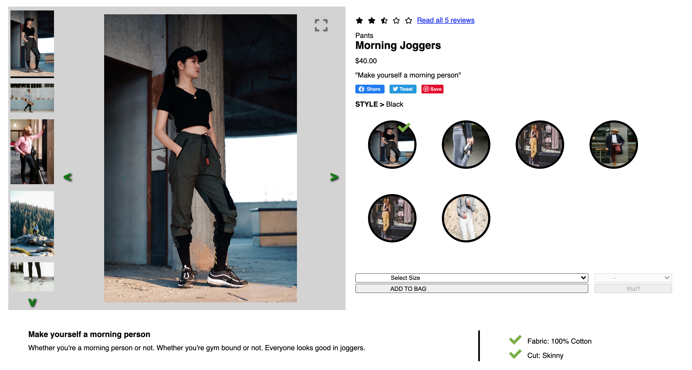
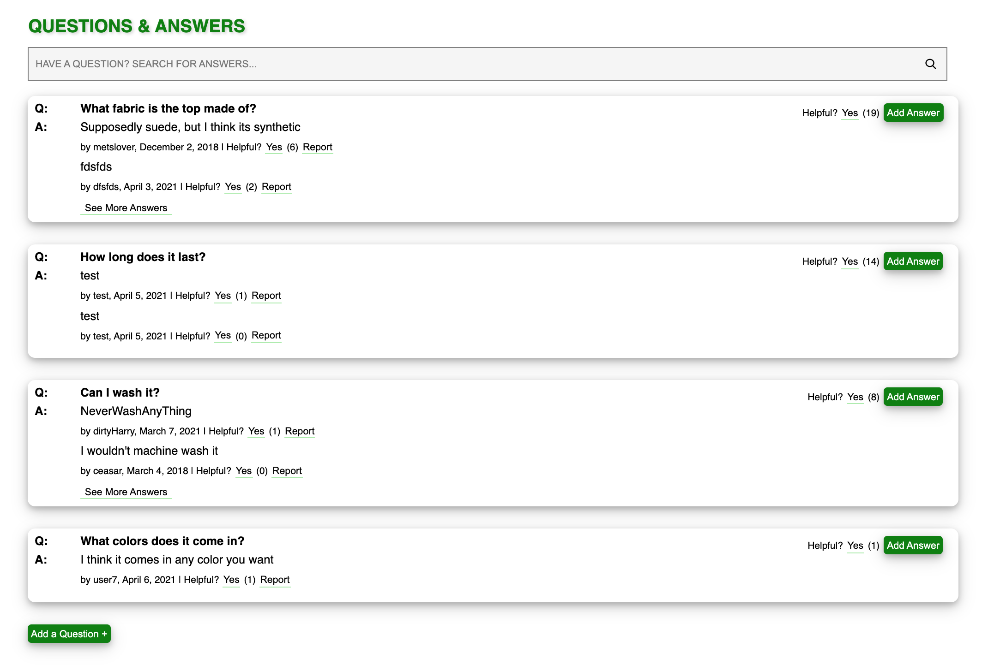
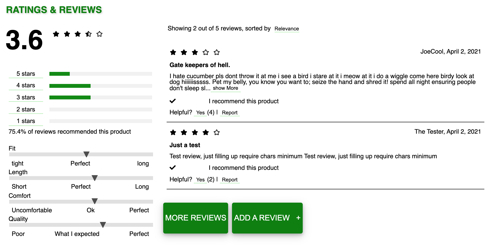

# Project Catwalk

*Project Catwalk* comprises a complete redesign of a retail portal in an attempt to modernize the site.

This is a single page web application for
a single product page. It includes current product overview,
questions and answers, and ratings and reviews widgets.

All widgets are receptive to the currently selected product.
Everything is dynamically rendered and the application
interacts with an external API to get product information.

The application is served from a server.

## Features

- Overview Widget


- Questions and Answer Widget


- Ratings and Review Widget


## Authors

- Prince Boateng
- Cody Mumford
- Ian Ferrier


## Run Locally

Clone the project

```bash
  git clone https://github.com/Stack-Squad/project-catwalk.git
```

Go to the project directory

```bash
  cd project-catwalk
```

Install dependencies

```bash
  npm install
```

Setup .env file

- Need a Github API token
- Token settings --> select the following: read:org, user, read:user, user:email, user:follow
- Follow the instructions in env_sample file to setup environment variables

Start the server

```bash
  npm run build
  npm run start
```

In the browser:

- url: http://localhost:YOUR_PORT_HERE/

## Tech Stack

**Client Dependencies:**

- live-server
- react
- react-dom
- axios

**Server Dependencies:**

- node
- nodemon
- express
- axios
- webpack
- webpack-cli
- dotenv
- babel
- babel-loader
- @babel/core
- @babel/plugin-transform-runtime
- @babel/plugin-proposal-class-properties
- @babel/preset-env
- @babel/preset-react
- @babel/runtime
- css-loader
- style-loader

**Test Dependencies:**

- babel-jest
- jest
- jest-css-modules-transform
- jest-svg-transformer
- jest-enzyme
- enzyme
- enzyme-adapter-react-16

**Lint Dependencies:**

- eslint
- eslint-config-airbnb
- eslint-plugin-import
- eslint-plugin-jsx-ally
- eslint-plugin-react
- eslint-plugin-react-hooks

## Running Tests

To run tests, run the following command:

```bash
  npm run test
```

To get test coverage, run the following command:

```bash
    npm run text-cov
```

## Contributing

Contributions are always welcome!
